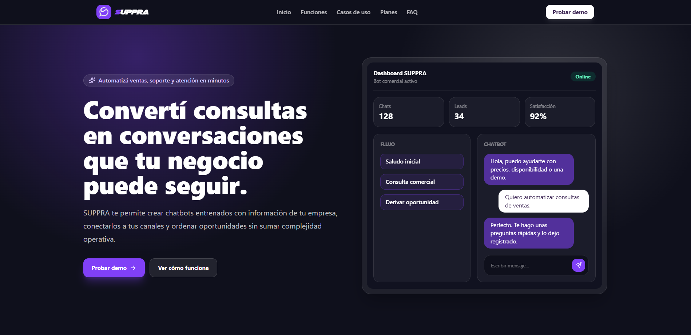
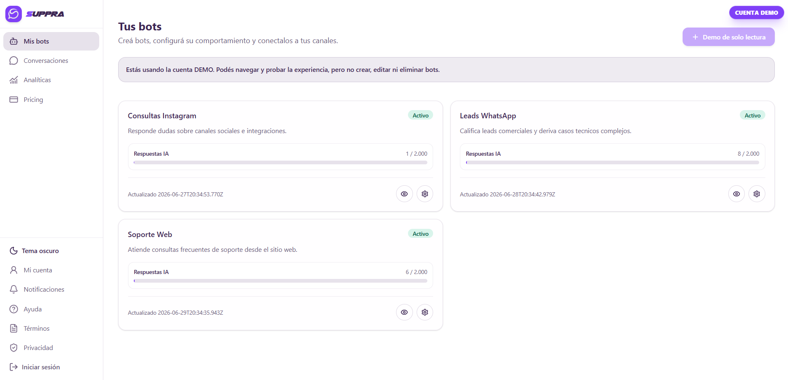
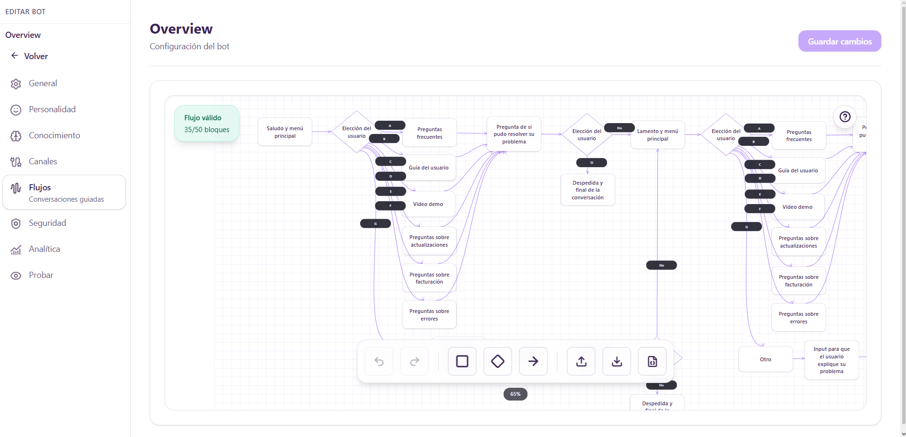
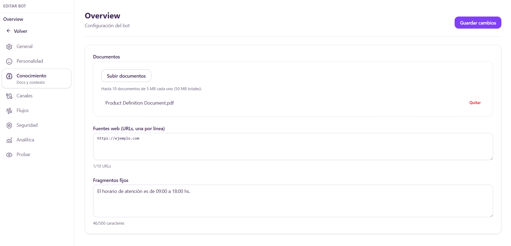

# SUPPRA – Conversational AI SaaS Platform

Production-ready AI SaaS platform designed for chatbot creation, conversational automation, and multi-channel customer interactions.

---

## 🚀 Overview

SUPPRA is a scalable multi-tenant SaaS platform currently running in production.

It centralizes chatbot management, knowledge configuration, AI orchestration, and channel integrations within a single environment.

The platform is designed around scalability, operational simplicity, and cost-controlled AI consumption.

---

## 🧠 Core Capabilities

- Multi-tenant chatbot management
- Configurable knowledge bases per bot
- Custom personality and behavior configuration
- Multi-model AI support (GPT and Gemini)
- Visual conversational flow builder
- Credit-based usage control system
- REST API integration capabilities
- Embeddable Web Widget deployment
- Conversation monitoring and analytics
- Structured Firestore architecture designed for scalable environments

---

## 🏗 System Architecture

High-level architecture flow:

Client (Dashboard / Widget)  
→ Firebase Authentication  
→ Firestore Database  
→ Cloud Functions  
→ AI Providers (OpenAI / Google AI)  
→ External Channels & APIs  

The platform centralizes AI orchestration, conversation processing, knowledge retrieval, and usage tracking while maintaining secure tenant isolation.

*(Architecture diagram available in /docs folder)*

---

## 💳 Credit-Based Usage Model

- Users consume credits based on AI interactions
- Credit validation occurs before model execution
- Usage tracking is performed centrally
- Designed to maintain predictable operating costs
- Supports scalable usage across multiple bots and channels

This model enables sustainable growth while keeping AI expenses under control.

---

## 🔐 Authentication & Security

- Email/Password authentication
- Multi-tenant data isolation
- Secure API Key management
- Environment separation (Development / Production)
- Role-based administrative controls
- Secure credential storage

---

## 🤖 Conversational Infrastructure

SUPPRA is designed as a conversational infrastructure platform rather than a standalone chatbot.

Each bot can maintain:

- Dedicated knowledge sources
- Independent behavior configuration
- Custom conversation flows
- Channel-specific deployment settings
- Separate usage monitoring

This architecture allows organizations to manage multiple assistants from a single platform.

---

## 📊 Production Context

SUPPRA is deployed in a live environment and actively maintained.

The system architecture prioritizes:

- Scalability across multiple tenants
- Cost-aware AI consumption
- Secure integration patterns
- Modular service orchestration
- Maintainable long-term architecture
- Expansion toward additional communication channels

---

## 🌎 Language Support

SUPPRA is currently available in Spanish.

Internationalization support is already considered in the platform architecture, with English and Portuguese planned for future releases.

The goal is to provide a localized experience for businesses across Latin America and international markets.

---

## 📸 Interface Preview

---

## ⚠️ Public Repository Notice

This repository provides a high-level architectural overview of the platform.

Sensitive business logic, proprietary workflows, internal prompts, and implementation-specific optimizations are intentionally excluded.

The purpose of this repository is to demonstrate SaaS architecture design, conversational AI infrastructure, multi-tenant system modeling, and production-level engineering practices.
